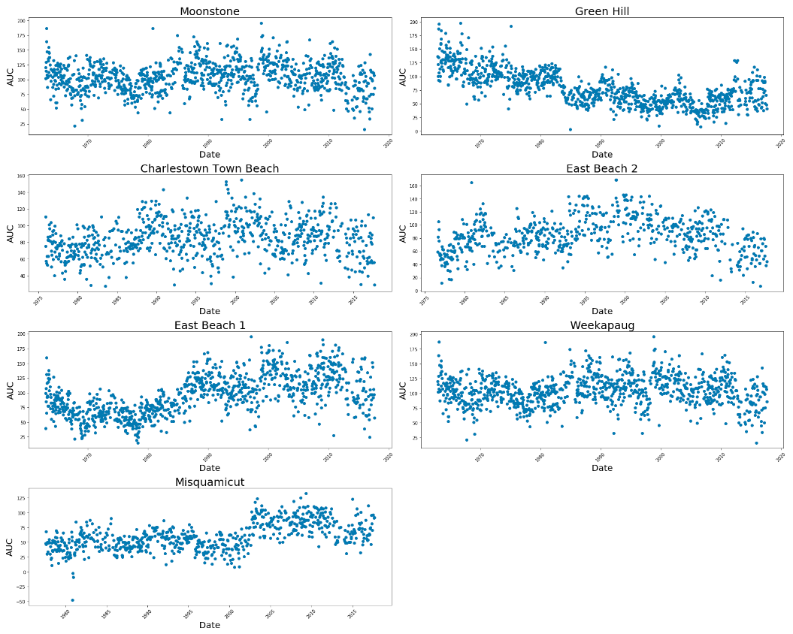

# Rhode Island Beach Profile Survey

## Project Objective
The purpose of the project is to create a timeseries of cumulative beach
profiles from beach survey data.

## Methods
* Data Transformation
* Data Visualization
* Time Series

## Technologies
* Python 3
* Python Packages:
  * Pandas
  * Datetime
  * Matplotlib
* Jupyter Notebook

## Project Description
This project provides cumulative beach volume as timeseries data for further
analysis.

The survey data are x and y values representing points along the top of a
particular slice of a beach at a some time. The areas under each curve (slice)
at a given time are calculated using the area of a trapezoid. The result is a
timeseries of data which reflect the changes in beaches over time.

The data are transformed by adding the absolute value of the lowest
y-value for each observation to each measurement.

 
<h3>
<u>Beach Profile Timeseries Plots</u>

## Getting Started
1. Clone this repo.
2. Unfortunately, the data for this project can not be shared.

## License
MIT License

Copyright (c) 2020 Justin Bosscher

Permission is hereby granted, free of charge, to any person obtaining a copy
of this software and associated documentation files (the "Software"), to deal
in the Software without restriction, including without limitation the rights
to use, copy, modify, merge, publish, distribute, sublicense, and/or sell
copies of the Software, and to permit persons to whom the Software is
furnished to do so, subject to the following conditions:

The above copyright notice and this permission notice shall be included in all
copies or substantial portions of the Software.

THE SOFTWARE IS PROVIDED "AS IS", WITHOUT WARRANTY OF ANY KIND, EXPRESS OR
IMPLIED, INCLUDING BUT NOT LIMITED TO THE WARRANTIES OF MERCHANTABILITY,
FITNESS FOR A PARTICULAR PURPOSE AND NONINFRINGEMENT. IN NO EVENT SHALL THE
AUTHORS OR COPYRIGHT HOLDERS BE LIABLE FOR ANY CLAIM, DAMAGES OR OTHER
LIABILITY, WHETHER IN AN ACTION OF CONTRACT, TORT OR OTHERWISE, ARISING FROM,
OUT OF OR IN CONNECTION WITH THE SOFTWARE OR THE USE OR OTHER DEALINGS IN THE
SOFTWARE.
